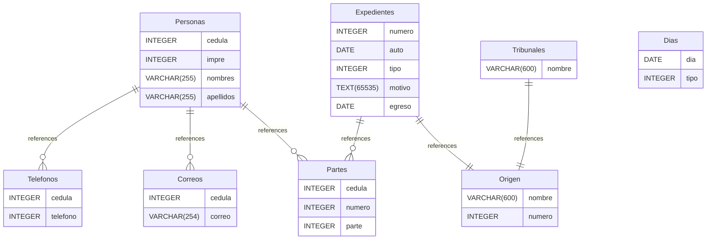

# ts3 documentation
## Summary

- [Introduction](#introduction)
- [Database Type](#database-type)
- [Table Structure](#table-structure)
	- [Personas](#personas)
	- [Telefonos](#telefonos)
	- [Correos](#correos)
	- [Partes](#partes)
	- [Expedientes](#expedientes)
	- [Origen](#origen)
	- [Tribunales](#tribunales)
	- [Dias](#dias)
- [Relationships](#relationships)
- [Database Diagram](#database-diagram)

## Introduction

## Database type

- **Database system:** SQLite
## Table structure

### Personas
Tabla que contiene todas las personas del índice. Contiene tanto abogados como no abogados, siendo diferenciados por la posesión de impre

| Name        | Type          | Settings                      | References                    | Note                           |
|-------------|---------------|-------------------------------|-------------------------------|--------------------------------|
| **cedula** | INTEGER | 🔑 PK, not null, unique | fk_Personas_cedula_Teléfonos,fk_Personas_cedula_Correos,fk_Personas_cedula_Partes |Cédula de identidad de la persona |
| **impre** | INTEGER | null, unique |  |Impre del abogado (en caso de serlo) |
| **nombres** | VARCHAR(255) | not null |  |Nombres de la persona |
| **apellidos** | VARCHAR(255) | not null |  |Apellidos de la persona | 

### Telefonos
Teléfonos de cada persona. Una persona puede tener varios teléfonos

| Name        | Type          | Settings                      | References                    | Note                           |
|-------------|---------------|-------------------------------|-------------------------------|--------------------------------|
| **cedula** | INTEGER | 🔑 PK, not null, unique |  |Cédula de la persona |
| **telefono** | INTEGER | 🔑 PK, not null, unique, default: 584 |  |Teléfono de la persona | 

### Correos
Correos de cada persona. Una persona puede tener varios correos

| Name        | Type          | Settings                      | References                    | Note                           |
|-------------|---------------|-------------------------------|-------------------------------|--------------------------------|
| **cedula** | INTEGER | 🔑 PK, not null, unique |  |Cédula de la persona |
| **correo** | VARCHAR(254) | null, unique |  |Correo de la persona | 

### Partes
Partes de un expediente. Cada persona ('cedula') está vínculada a un 'numero' de expediente y cumple con un rol ("parte")

| Name        | Type          | Settings                      | References                    | Note                           |
|-------------|---------------|-------------------------------|-------------------------------|--------------------------------|
| **cedula** | INTEGER | 🔑 PK, not null, unique |  |Cedula de la persona |
| **numero** | INTEGER | 🔑 PK, not null |  |Número del expediente |
| **parte** | INTEGER | 🔑 PK, not null |  |Bitflag que representa qué rol desempeña la parte:

0: demandado
1: abogado del demandado
2: demandante
3: abogado del demandante | 

### Expedientes
Expedientes. Identificados por su número, poseen un "auto" (fecha de entrada), un "tipo" que define los lapsos procesales a los que se somete, un motivo (de la disputa) y una fecha de egreso una vez que se cumplan todos los lapsos procesales

| Name        | Type          | Settings                      | References                    | Note                           |
|-------------|---------------|-------------------------------|-------------------------------|--------------------------------|
| **numero** | INTEGER | 🔑 PK, not null, unique | fk_Expedientes_numero_Partes,fk_Expedientes_numero_origen |Número del expediente |
| **auto** | DATE | not null |  |Fecha de entrada del expediente |
| **tipo** | INTEGER | not null |  |Bitflag que indica el tipo de expediente:

0: interlocutorias
1: definitivas
2: breve
3: recusaciones |
| **motivo** | TEXT(65535) | not null |  |Motivo del expediente |
| **egreso** | DATE | null |  |Fecha en la que sale el expediente según los datos de los días en los que se dió despacho y demás | 

### Origen
Tribunal que origina el expediente

| Name        | Type          | Settings                      | References                    | Note                           |
|-------------|---------------|-------------------------------|-------------------------------|--------------------------------|
| **nombre** | VARCHAR(600) | 🔑 PK, not null |  |Nombre del tribunal de origen |
| **numero** | INTEGER | 🔑 PK, not null |  |Número del expediente | 

### Tribunales
Tribunales conocidos

| Name        | Type          | Settings                      | References                    | Note                           |
|-------------|---------------|-------------------------------|-------------------------------|--------------------------------|
| **nombre** | VARCHAR(600) | 🔑 PK, not null, unique | fk_Tribunales_nombre_origen |Nombre del tribunal | 

### Dias

| Name        | Type          | Settings                      | References                    | Note                           |
|-------------|---------------|-------------------------------|-------------------------------|--------------------------------|
| **dia** | DATE | 🔑 PK, not null, unique |  |Día que se está registrando |
| **tipo** | INTEGER | 🔑 PK, not null |  |Bitflag que indica qué tipo de día fue:

- 0: laboral con despacho
- 1: laboral sin despacho
- 2: no laboral
- 3: feriado
- 4: receso judicial

## Relationships

- **Personas to Telefonos**: one_to_many
- **Personas to Correos**: one_to_many
- **Personas to Partes**: one_to_many
- **Expedientes to Partes**: one_to_many
- **Expedientes to Origen**: one_to_one
- **Tribunales to Origen**: one_to_one

## Database Diagram

